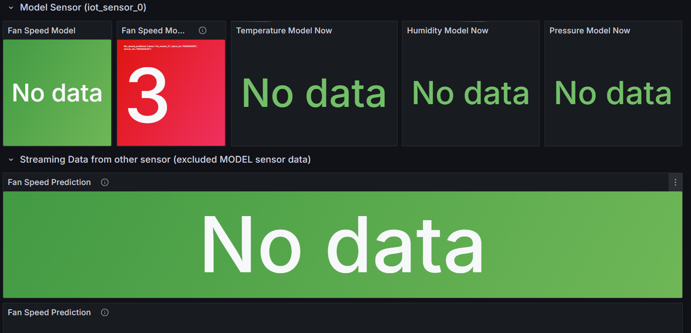

# Online Prediction

<!-- Online Prection ทำงานอย่างไร  -->
Online Prediction คือการทำนายผลแบบ เรียลไทม์ โดยเมื่อมีข้อมูลใหม่เข้ามา (เช่น จาก Kafka หรือ MQTT) โมเดล ML จะประมวลผลและส่งผลลัพธ์ออกทันที ต่างจาก Batch ML ที่ต้องรอรวบรวมข้อมูลก่อนแล้วค่อยทำนายทีหลัง

## ปิดการใช้งานของ Batch ML ดังนี้

1. Batch ML จะรอให้มีข้อมูลสะสมจำนวนมากก่อน  แล้วค่อย train โมเดลทีเดียว
2. การอัปเดตโมเดลต้อง retrain ใหม่ทั้งหมด
3. ไม่สามารถตอบสนองต่อข้อมูล real-time ได้ทันที

## เริ่มใช้งาน Online ML ดังนี้

1. Online ML จะเรียนรู้จากข้อมูลที่เข้ามาแบบทีละ record หรือทีละ event
2. เมื่อมีข้อมูลใหม่เข้ามา โมเดลสามารถ update parameter ทันที โดยไม่ต้อง retrain ทั้งหมด
3. เหมาะกับงาน IoT Streaming เช่น MQTT  Kafka  Online ML  Dashboard

## ผลที่ได้จากการใช้ ML มีดังนี้

<!-- แนบรูป Grafana  พร้อมอธิบาย -->
ได้ผลการทำนาย (prediction) แบบ real-time
สามารถแสดงผลบน Grafana Dashboard
ข้อมูลจะอัปเดตต่อเนื่องทุกครั้งที่มี sensor data ใหม่